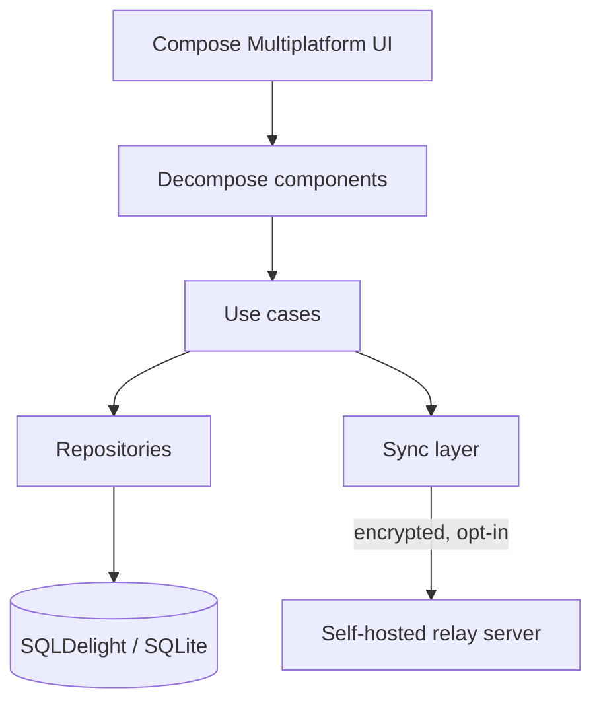

# Solista

**A store-aware shopping list for Android and iOS.** Every list follows the route you actually walk through each store — item by item, not just by category.

🌐 [getsolista.app](https://getsolista.app) · Current build **v0.5.3** · Release preparation in progress

> **Showcase repository.** The source code is private. This page describes what the app does and how it is built.

<!-- SCREENSHOTS: add images to /screenshots and uncomment

  
  
  
  

-->

## The idea

Most shopping list apps sort by category at best. In reality every store is laid out differently. Solista lets you define the walking route for each store once — afterwards every list appears in exactly that order.

## Features

- **Route-based sorting per store** at item level; the explicit route is the single source of truth.
- **"In the cart" section:** checking an item off marks it as done without moving it out of its route position; undo puts it straight back.
- **Local-first:** all data lives on the device in a local SQLite database. The app is fully usable offline.
- **Share as copy** via link or QR code — no server, no account.
- **Optional shared lists** (opt-in): encrypted list sharing via a self-hosted relay server. No accounts, no email addresses, no phone numbers.
- **Member profiles without accounts** for assignment and "checked off by".

## Architecture

- **Kotlin Multiplatform** with one shared codebase for Android and iOS; platform specifics via `expect`/`actual`.
- **Compose Multiplatform** for the UI, **Decompose** for navigation and state, **Koin** for dependency injection.
- **SQLDelight** as the only persistence layer, with versioned schema migrations.
- **Relay server:** Node.js, SQLite, Docker — stores only data it cannot read.

## Tech stack

Kotlin · Kotlin Multiplatform · Compose Multiplatform · SQLDelight · Decompose · Koin · Ktor · Coroutines/Flow · kotlinx.serialization · Node.js · Docker · Forgejo Actions (CI)

## Quality

- Unit tests for use cases, repositories, components, database and sync logic
- CI with Forgejo Actions runs the test suite on every push
- Versioning derived from Git tags (SemVer), shared by Android and iOS builds

## Status

Android is the first release platform; the iOS target is prepared. Play Store release is in preparation.

---

Built by [Oliver Drewing](https://drewing.dev) · Android & Product Engineer
